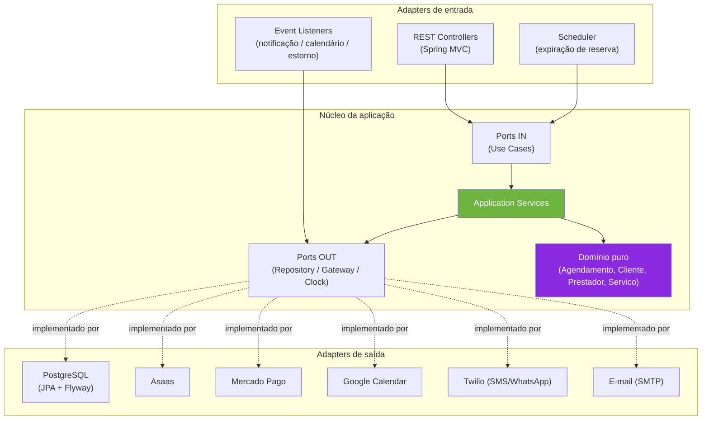
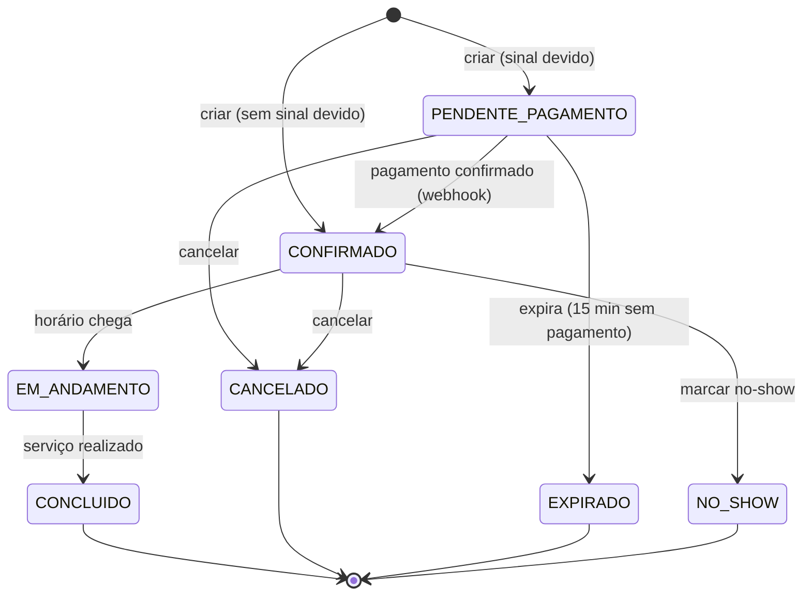

# 📅 Agendamento com Cobrança via Pix

> Plataforma de agendamento para prestadores de serviço (clínicas, barbearias, estúdios) com
> cobrança automática de sinal e multa de cancelamento via **Pix** — projeto de portfólio em
> **arquitetura hexagonal**, construído para demonstrar separação real entre domínio, aplicação
> e infraestrutura, com integrações externas de verdade e uma suíte de testes abrangente.

<p align="center">
  
  
  
  
  <br>
  
  
  
  
</p>

<p align="center">
  
  
  
  
  
</p>

---

## 📑 Sumário

- [Visão geral](#-visão-geral)
- [Principais funcionalidades](#-principais-funcionalidades)
- [Arquitetura](#-arquitetura)
- [Stack técnico](#-stack-técnico)
- [Como executar](#-como-executar)
- [Variáveis de ambiente](#-variáveis-de-ambiente)
- [API REST](#-api-rest)
- [Segurança, observabilidade e performance](#-segurança-observabilidade-e-performance)
- [Estratégia de testes](#-estratégia-de-testes)
- [Estrutura do projeto](#-estrutura-do-projeto)
- [CI/CD](#-cicd)
- [Roadmap](#-roadmap)
- [Documentação completa](#-documentação-completa)
- [Licença](#-licença)

---

## 🔭 Visão geral

Um prestador de serviço cadastra sua agenda, serviços e política de cancelamento; um cliente
cria um agendamento e, quando o serviço exige sinal, recebe um QR Code Pix para pagar; o
pagamento confirmado via webhook libera a reserva automaticamente. Cancelamentos fora da janela
de antecedência retêm parte do sinal; clientes com histórico de no-show passam a exigir sinal
obrigatório.

O projeto existe para demonstrar, com código real (não um TODO-list disfarçado), como arquitetura
hexagonal se comporta quando confrontada com problemas de produção de verdade: dois gateways de
pagamento intercambiáveis, webhooks com assinatura criptográfica, sincronização de calendário
externo, notificação multicanal, autenticação, rate limiting, observabilidade e uma suíte de
testes que cobre domínio, aplicação, web e persistência — cada camada com a ferramenta certa.

## ✨ Principais funcionalidades

| Área | O que faz |
|---|---|
| 📆 **Agendamento** | Detecção de conflito de horário, máquina de estados completa (`PENDENTE_PAGAMENTO → CONFIRMADO → EM_ANDAMENTO → CONCLUIDO`, com `CANCELADO`/`EXPIRADO`/`NO_SHOW` como estados terminais), expiração automática de reservas pendentes via scheduler. |
| 💰 **Cobrança Pix** | Dois gateways reais e intercambiáveis — **Asaas** e **Mercado Pago** — trocados só por `PAGAMENTO_GATEWAY`, sem mudar uma linha de código de aplicação. QR Code + copia-e-cola gerados na criação do agendamento. |
| 🔁 **Webhooks reais** | Payload nativo de cada gateway (não um formato genérico inventado): token simples (Asaas) e assinatura **HMAC-SHA256** (Mercado Pago), ambos validados em **tempo constante** (`MessageDigest.isEqual`). |
| 📉 **Política de cancelamento** | Retenção de sinal proporcional fora da janela de antecedência mínima; cliente com 2+ no-shows passa a exigir sinal obrigatório (mínimo 50%) mesmo em serviços sem sinal configurado. |
| 🔔 **Notificação multicanal** | E-mail (SMTP) + WhatsApp (Twilio) disparados nos eventos de domínio — assíncrono, cada canal isolado (falha de um nunca impede o outro nem o caso de uso). |
| 📅 **Google Calendar** | Sincroniza o evento externo na confirmação, remove no cancelamento — via conta de serviço, sem fluxo OAuth2 interativo. |
| 🔐 **Autenticação** | Login de `Prestador` via sessão + cookie, BCrypt, CSRF habilitado, **rate limiting** contra força bruta (5 falhas → bloqueio de 5 min). |
| 📊 **Observabilidade** | Métricas Prometheus (`/actuator/prometheus`), health check, correlação de log por requisição (MDC + `X-Request-Id`), propagada inclusive para o processamento assíncrono. |
| 🖥️ **Frontend completo** | React + Vite, zero código compartilhado com o backend — dá para executar o fluxo inteiro (cadastro → agendamento → pagamento → cancelamento) numa interface, sem Swagger/curl. |

## 🏛 Arquitetura

Hexagonal (portas e adapters), com a regra de dependência **garantida automaticamente a cada
build** por testes ArchUnit — não é só convenção documentada, é verificada em CI:



**Regras garantidas por `ArchitectureTest` (ArchUnit):**
- `domain` não importa Spring, JPA nem nada de `adapter.*` — Java puro, testável sem container.
- `application` não importa `adapter.*` nem JPA (pode depender de Spring — beans `@Service`).
- Zero ciclos de pacote entre `domain` / `application` / `adapter`.

Trocar PostgreSQL ↔ repositórios em memória, ou Asaas ↔ Mercado Pago, é **só configuração**
(`@Profile`, `@ConditionalOnProperty`) — nenhuma linha de domínio ou de caso de uso muda.

<details>
<summary>📍 Máquina de estados do agendamento</summary>


</details>

## 🧰 Stack técnico

<table>
<tr><td><b>Backend</b></td><td>

Java 21 · Spring Boot 4.1.1 · Spring Security · Spring Data JPA · Spring Validation ·
PostgreSQL 16 · Flyway · Micrometer/Prometheus · springdoc-openapi (Swagger UI)

</td></tr>
<tr><td><b>Frontend</b></td><td>

React 18 · Vite 8 · React Router 7 · JavaScript puro (sem TypeScript) · CSS puro (sem framework)

</td></tr>
<tr><td><b>Integrações externas</b></td><td>

Asaas · Mercado Pago · Google Calendar API · Twilio (SMS/WhatsApp) · SMTP

</td></tr>
<tr><td><b>Testes</b></td><td>

JUnit 5 · AssertJ · Mockito · ArchUnit · Testcontainers · WireMock · GreenMail ·
Vitest · React Testing Library · ESLint

</td></tr>
<tr><td><b>Infra & DevOps</b></td><td>

Docker · Docker Compose · GitHub Actions (CI)

</td></tr>
</table>

## 🚀 Como executar

### Pré-requisitos

- Java 21+ e Maven (ou use o Maven bundlado do IntelliJ, ver `CLAUDE.md`)
- Docker + Docker Compose
- Node.js ≥ 22.12 (para o frontend)

### Opção 1 — tudo via Docker Compose

```bash
docker-compose up -d
# API em http://localhost:8080 (perfil padrão, Postgres real, migrations via Flyway)
```

### Opção 2 — backend local + Postgres em container

```bash
docker-compose up -d postgres
mvn spring-boot:run
# ou, pelo IntelliJ: rodar AgendamentoApplication (perfil padrão)
```

> ⚠️ **Nunca** use o perfil `dev` para demonstrar a aplicação — ele troca toda a persistência e
> as integrações externas por adapters em memória/fake, e existe só para os testes.

### Frontend

```bash
cd frontend
npm install
npm run dev
# http://localhost:5173 — precisa do backend rodando em localhost:8080
```

Fluxo completo testável pela interface: cadastrar prestador (com login) → cadastrar serviço e
cliente → criar agendamento → pagar (webhook simulado) → ver a agenda → cancelar / marcar no-show.

### Documentação interativa da API

Com o backend no ar: **http://localhost:8080/swagger-ui.html**

## ⚙️ Variáveis de ambiente

Nenhuma é obrigatória para a aplicação subir — sem elas, só as integrações reais correspondentes
ficam indisponíveis.

| Variável | Integração | Padrão |
|---|---|---|
| `PAGAMENTO_GATEWAY` | Escolhe o gateway ativo | `asaas` |
| `ASAAS_API_KEY` / `ASAAS_WEBHOOK_TOKEN` | Asaas | _(vazio)_ |
| `MERCADOPAGO_ACCESS_TOKEN` / `MERCADOPAGO_WEBHOOK_SECRET` | Mercado Pago | _(vazio)_ |
| `GOOGLE_CALENDAR_CREDENTIALS` / `GOOGLE_CALENDAR_ID` | Google Calendar | _(vazio)_ |
| `TWILIO_ACCOUNT_SID` / `TWILIO_AUTH_TOKEN` / `TWILIO_SMS_FROM` | Twilio | _(vazio)_ |
| `SMTP_HOST` / `SMTP_PORT` / `SMTP_USERNAME` / `SMTP_PASSWORD` | E-mail | `localhost:1025` |
| `SESSION_COOKIE_SECURE` / `SESSION_COOKIE_SAME_SITE` | Cookie de sessão/CSRF | `false` / `lax` |
| `APP_CORS_ALLOWED_ORIGINS` | CORS | `http://localhost:5173` |

## 📡 API REST

Contrato completo em [`specs/03-api-rest.md`](specs/03-api-rest.md). Resumo:

| Método | Rota | Autenticação | Descrição |
|---|---|---|---|
| `POST` | `/api/prestadores` | Pública | Cadastro de prestador (também é o sign-up de login) |
| `GET` | `/api/prestadores` | Pública | Lista prestadores (paginação opcional `page`/`size`) |
| `PUT` | `/api/prestadores/{id}` | 🔒 Própria sessão | Edita nome/telefone |
| `POST` / `POST` / `GET` | `/api/auth/login` / `/logout` / `/me` | Pública | Login, logout e sessão atual |
| `POST` / `GET` / `PUT` / `DELETE` | `/api/clientes` | Pública | CRUD de cliente |
| `POST` / `PUT` / `DELETE` | `/api/servicos` | 🔒 Dono do serviço | Cadastro/edição de serviço |
| `GET` | `/api/servicos?prestadorId=` | Pública | Lista serviços de um prestador |
| `POST` | `/api/agendamentos` | Pública | Cria agendamento (gera cobrança Pix se houver sinal) |
| `GET` | `/api/agendamentos/{id}` | Pública | Consulta um agendamento |
| `GET` | `/api/agendamentos` | 🔒 Própria sessão | Agenda do prestador logado |
| `POST` | `/api/agendamentos/{id}/cancelar` · `/no-show` | Pública | Transições de estado |
| `POST` | `/api/webhooks/asaas` · `/mercadopago` | Token/HMAC | Confirmação de pagamento |
| `GET` | `/actuator/health` · `/actuator/prometheus` | Pública | Observabilidade |

## 🛡 Segurança, observabilidade e performance

Resultado de uma auditoria dedicada a esses três temas, com cada achado corrigido e validado
contra uma instância real (Postgres real, não só testes unitários):

- **Comparação de segredos em tempo constante** (`MessageDigest.isEqual`) nos dois webhooks —
  proteção contra timing attack na validação de token/assinatura HMAC.
- **Timeout de conexão e leitura** nos 4 clientes HTTP externos — uma API de terceiro travada
  não prende mais a thread da requisição indefinidamente.
- **Processamento assíncrono dos efeitos colaterais de domínio** (notificação, calendário,
  estorno) num pool dedicado — não compete com o pool HTTP do Tomcat, com o id de correlação de
  log propagado via `MDC` + `TaskDecorator` mesmo entre threads.
- **Rate limiting no login** — 5 tentativas falhas bloqueiam o e-mail por 5 minutos.
- **Métricas Prometheus** (`/actuator/prometheus`) e **correlação de log por requisição**
  (`X-Request-Id`), inclusive em efeitos assíncronos.
- **Cookies com `Secure`/`SameSite` configuráveis** por variável de ambiente, política de senha
  com exigência de complexidade, paginação opt-in nos endpoints de listagem.

Detalhamento completo, com arquivo:linha de cada achado, em
[`specs/04-roadmap.md`](specs/04-roadmap.md).

## 🧪 Estratégia de testes

| Camada | Ferramenta | O que valida |
|---|---|---|
| Domínio | JUnit 5 + AssertJ (sem Spring) | Regras de negócio puras — máquina de estados, VOs, política de cancelamento |
| Aplicação | JUnit 5 + Mockito + adapters em memória reais | Casos de uso orquestrando portas, sem mock do próprio domínio |
| Web | `@WebMvcTest` + `@MockitoBean` | Controllers, DTOs, status HTTP, autenticação/CSRF |
| Persistência | Testcontainers (PostgreSQL real) | Mapeamento JPA, migrations Flyway, queries derivadas |
| Gateways de pagamento / Google Calendar / Twilio | WireMock | Integração real simulada, sem chamada de rede de verdade |
| E-mail | GreenMail | Entrega real via SMTP em memória |
| Arquitetura | ArchUnit | Regras de dependência entre camadas, a cada build |
| Frontend | Vitest + React Testing Library | Wrapper de API, contexto de autenticação, componentes |

```bash
mvn test                 # suíte Java completa (242 testes)
cd frontend && npm test   # suíte do frontend
```

## 🗂 Estrutura do projeto

```
agendamento_com_cobranca_pix/
├── src/main/java/org/example/agendamento/
│   ├── domain/            # Java puro — entidades, VOs, máquina de estados, eventos
│   ├── application/       # casos de uso (ports/in), ports/out, services
│   ├── adapter/
│   │   ├── in/web/        # controllers REST, DTOs, security, GlobalExceptionHandler
│   │   ├── in/evento/     # listeners de evento de domínio (@Async)
│   │   ├── in/scheduler/  # expiração de reservas pendentes
│   │   └── out/           # JPA, gateways de pagamento, Google Calendar, Twilio, e-mail
│   └── config/            # CORS, Async, properties de integração
├── src/main/resources/
│   └── db/migration/      # migrations Flyway
├── src/test/java/         # espelha a estrutura de main, + architecture/
├── frontend/               # React + Vite, projeto Node separado
├── specs/                  # fonte da verdade: domínio, casos de uso, API, roadmap
├── docker-compose.yml
├── Dockerfile
└── .github/workflows/ci.yml
```

## 🔄 CI/CD

GitHub Actions (`.github/workflows/ci.yml`) roda em todo push/PR para `main`:

- **Backend**: `mvn test` (suíte completa, inclusive ArchUnit e Testcontainers) + build da
  imagem Docker.
- **Frontend**: `npm run lint` → `npm test` → `npm run build`.

## 🧭 Roadmap

O que já foi entregue e o que está consciente e explicitamente pendente — com o porquê de cada
decisão — está documentado em [`specs/04-roadmap.md`](specs/04-roadmap.md). Alguns destaques do
que falta por decisão deliberada de escopo (não por esquecimento):

- Login de `Cliente` (hoje só `Prestador` autentica).
- Paginação real no banco (hoje corta a lista já carregada — opt-in, sem quebrar os `<select>`
  do frontend que precisam da lista completa).
- Retry/fila para estornos que falham (hoje só logado).

## 📚 Documentação completa

| Documento | Conteúdo |
|---|---|
| [`specs/00-visao-geral.md`](specs/00-visao-geral.md) | Escopo funcional e diferenciais de arquitetura |
| [`specs/01-dominio.md`](specs/01-dominio.md) | Entidades, value objects, regras de negócio críticas |
| [`specs/02-casos-de-uso.md`](specs/02-casos-de-uso.md) | Casos de uso da camada de aplicação |
| [`specs/03-api-rest.md`](specs/03-api-rest.md) | Contrato REST completo, request/response de cada endpoint |
| [`specs/04-roadmap.md`](specs/04-roadmap.md) | Entregue, pendente e débito técnico conhecido |
| [`CLAUDE.md`](CLAUDE.md) | Guia de arquitetura e convenções para quem for evoluir o projeto |

## 📄 Licença

Projeto de portfólio, desenvolvido para fins de estudo e demonstração de arquitetura hexagonal
em Java/Spring Boot. Sem licença de distribuição formal definida.

---

<p align="center">Feito como projeto de portfólio — arquitetura hexagonal, Java 21 + Spring Boot 4.1.1.</p>
